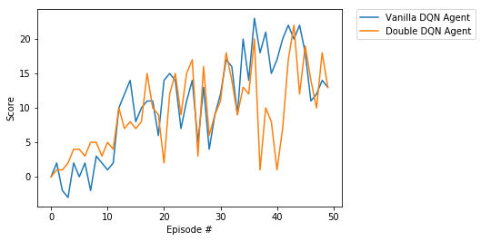

[//]: # (Image References)

[image1]: https://user-images.githubusercontent.com/10624937/42135619-d90f2f28-7d12-11e8-8823-82b970a54d7e.gif "Trained Agent"

# Deep Reinforcement Learning Nanodegree Project 1: Navigation

## Introduction

![Trained Agent][image1]

The files included in this repository implement a DQN agent capable of navigating a large square world with the goal of collecting yellow bananas while avoiding blue bananas. This environment is similar, but not identical to [Unity ML-Agents' Banana Collector](https://github.com/Unity-Technologies/ml-agents/blob/master/docs/Learning-Environment-Examples.md#banana-collector) environment.

The mechanics of the envonment are as follows:

- *Rewards*: +1 for collecting a yellow banana, -1 for collecting a blue banana.
- *State space*: 37 dimensions (includes agent's velocity, along with ray-based perception of objects around agent's forward direction)
- *Action space*: 4 discrete actions:
    - **`0`** - move forward
    - **`1`** - move backward
    - **`2`** - turn left
    - **`3`** - turn right

The environment is considered solved once the agent has an average score of +13 over 100 consecutive episodes.

## Getting Started

1. Clone this repository.

2. Download the environment from one of the links below. You need only select the environment that matches your operating system:
    - Linux: [click here](https://s3-us-west-1.amazonaws.com/udacity-drlnd/P1/Banana/Banana_Linux.zip)
    - Mac OSX: [click here](https://s3-us-west-1.amazonaws.com/udacity-drlnd/P1/Banana/Banana.app.zip)
    - Windows (32-bit): [click here](https://s3-us-west-1.amazonaws.com/udacity-drlnd/P1/Banana/Banana_Windows_x86.zip)
    - Windows (64-bit): [click here](https://s3-us-west-1.amazonaws.com/udacity-drlnd/P1/Banana/Banana_Windows_x86_64.zip)
    
    (_For AWS_) If you'd like to train the agent on AWS (and have not [enabled a virtual screen](https://github.com/Unity-Technologies/ml-agents/blob/master/docs/Training-on-Amazon-Web-Service.md)), then please use [this link](https://s3-us-west-1.amazonaws.com/udacity-drlnd/P1/Banana/Banana_Linux_NoVis.zip) to obtain the environment.

3. Place the downloaded file in the folder you cloned this repo to and unzip (or decompress) the file.

4. Create a Python environment for this project. I recommend using `conda` or `venv`.

5. Activate that environment and install dependencies: 
    ```
    pip install -r requirements.txt
    ```

## Instructions

1. Open the `Navigation.ipynb` notebook and adjust the path to the environment file based on its name and where you placed it.

2. You are ready to start interacting with the environment.
    - Use the cells in sections 1, 2 and 3 to initialize and explore the environment
    - Run the cells in section 4 to train the agent. Feel free to change the hyperparameters in `dqn_agent.py` to see if you can improve training.
    - Run the cells in section 5 to test the agent.

# DRLND Project 1 Report (Navigation)

## Introduction

For this project, the DQN algorithm was chosen for implementation.

I decided to use DQN because it is a great value-based algorithm that is known to perform well in discrete actions spaces such as the one for this environment. 

## Learning Algorithm

DQN is an algorithm created by DeepMind that brings together the power of the Q-Learning algorithm with the advantages of generalization through function approximation. It uses a deep neural network to estimate a Q-value function. As such, the input to the network is the current state of the environment, and the output is the Q-value for each action.

DeepMind also came up with two techniques that help successfully train a DQN agent:
- *Replay buffer*: Stores a finite collection of previous experiences that can be sampled randomly in the learning step. This helps break the correlation between consecutive actions, which leads to better conversion.
- *Separate target network*: Similar to the local network in structure, this network helps prevent large fluctuations in network updates, which leads to more stable training.

There have been multiple improvements to vanilla DQN suggested by RL researchers. In this project, I decided to implement a method called Double DQN. This method helps prevent the overestimation of Q-values, which is something that DQN agents are susceptible to. It does so by using the main network to pick the best action and the target network to evaluate that action for a given state. The idea here is that the two networks must agree that an action is good.

The DQN implementation for this project also includes soft updates of the target network. This is different from the periodic updates mentioned in the original DeepMind paper. This update mechanism uses the `TAU` hyperparameter. Other important hyperparameters include
* `LEARNING_RATE`, 
* `GAMMA` for discounted future rewards,
* `REPLAY_BUFFER_SIZE`,
* `BATCH_SIZE`, which controls the number of experiences sampled from the replay buffer in the learning step.

The model architecture used is the same for both the local and target networks. It consists of 3 fully-connected layers. The first 2 layers use a ReLU activation, while the output layer has the option of using a softmax activation or no activation.

## Plot of Rewards

For the network architecture, I ended up settling on 96 as the hidden layer's input size and 64 as the hidden layer's output size. As for hyperparameters, I found that my agent performed much better after I increased the size of the replay buffer (`REPLAY_BUFFER_SIZE`) from `1e5` to `2e5`. This makes sense since the agent had more experience tuples to learn from in its update step. Decreasing the `GAMMA` from `0.99` to `0.95` also helped. For the final values of the hyperparameters, please check `dqn_agent.py`.



The graph above shows the score for two agents over 1000 episodes. One of the agents used a vanilla DQN implementation, while the other used double DQN in the learn step. Other than this small difference, both agents were trained using the same network structure and hyperparameters. 

As you can see from above, the two agents perform very similarly in this environment. Across multiple runs, I found that both agents usually solve the environment after about 500-600 episodes, eventually setting at a score close to 16 after 1000 episodes.

I tried comparing the performance of using softmax activation or not in the output layer. I found that while using softmax, the agent never solved the environment. In fact, it did not seem to have learned anything at all after 1000 episodes. Later on, I ended up realizing that using softmax does not make too much sense in this case since nowhere in the implementation I am interested in the probability of picking an action based on the Q-values for each action in a given state. Still, I thought I would note this finding in here as part of my learning experience.

## Ideas for Future Work

To improve upon these results, my main idea is to implement a series of DQN improvements that have been suggested in recent years, including: 

* prioritized experience replay, 
* dueling DQNs, 
* multi-step bootstrap targets, 
* distributional DQN and 
* noisy DQN. 

A source of inspiration, and a good reading to get started towards this goal is DeepMind's [Rainbow paper](https://arxiv.org/abs/1710.02298).

Another idea would be to try different agorithms and see how they perform against DQN. Simpler methods such as SARSA and Q-Learning could be used for this purpose, along with many other policy-based methods.